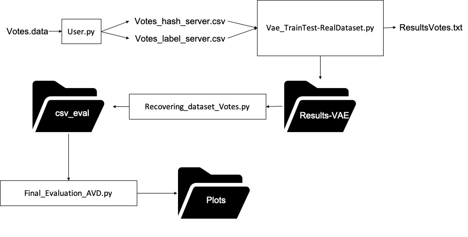

# LDP-VAE
This repository contents the information to reproduce the results presented in the conference [EDBT-ICDT 2022](http://edbticdt2023.cs.uoi.gr/)

In this experiments, we propose use VAE in LDP approach

User.py encodes users data using Hash Functions as suggested in [LoPub](https://ieeexplore.ieee.org/document/8306916)

Vae_TrainTest-RealDataset.py trains all the attributes available in dataset, then the original dataset is encoded and pertubed
  to be analyzed using the latent space created by VAE.
Results-VAE.py joins the results created by VAE.
Final_Evaluation_AVD.py computes LASSO and AVD distance.

This experiments were run on a machine with Intel Core i7-12700H with a GPU NVIDIA GeForce RTX 3070Ti

Python 3.9.12 and CUDA version 11.6

pip list is available in requierements.txt
